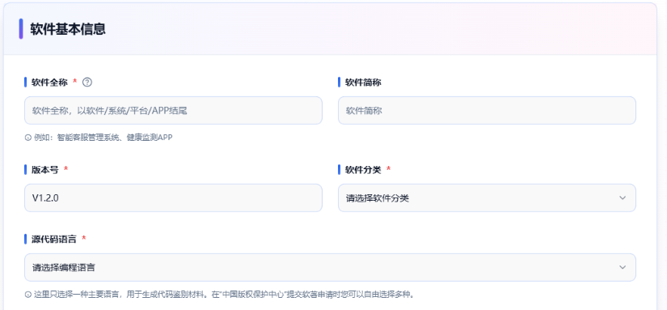
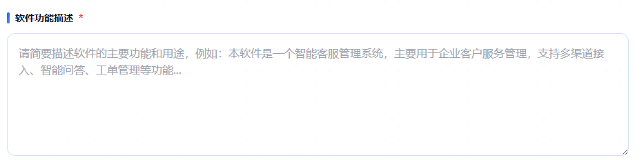
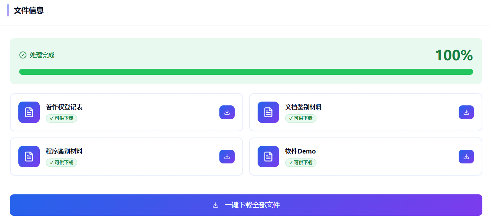

# 玖涯软著AI

专业的AI软著申请工具，一键自动生成源代码、用户手册、设计说明书和操作说明书。

## 一、生成流程

1. 输入基本信息

   填写软件名称、版本号等基础信息。
   

2. 描述软件功能

   简要描述软件的主要功能和特点
   

   

3. AI生成材料

   AI自动生成所有申请所需的文档材料。
   

4. 下载提交

   下载生成的材料，提交软著申请。

## 二、使用地址

玖涯软著：https://rz.nineya.com

## 三、联系方式

有任何问题，请联系微信玖涯菜菜子（nineyaccz）

